# Cloud-Alibaba

文档参考：https://spring-cloud-alibaba-group.github.io/github-pages/hoxton/en-us/index.html

# 创建项目

## 版本对应关系

springboot、cloud、cloud-alibaba的对应关系说明：

请参考cloud-alibaba：https://github.com/alibaba/spring-cloud-alibaba/wiki/%E7%89%88%E6%9C%AC%E8%AF%B4%E6%98%8E

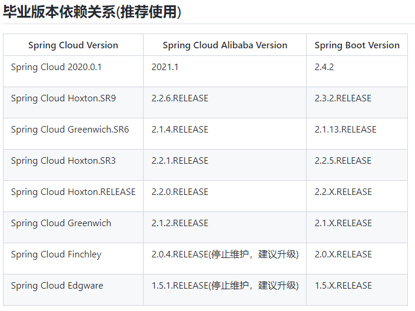

1、Spring Cloud 2020

如果需要使用 Spring Cloud 2020 版本，请在 dependencyManagement 中添加如下内容：

```java
<dependency>
    <groupId>com.alibaba.cloud</groupId>
    <artifactId>spring-cloud-alibaba-dependencies</artifactId>
    <version>2021.1</version>
    <type>pom</type>
    <scope>import</scope>
</dependency>
```

2、Spring Cloud Hoxton

如果需要使用 Spring Cloud Hoxton 版本，请在 dependencyManagement 中添加如下内容：

```java
<dependency>
    <groupId>com.alibaba.cloud</groupId>
    <artifactId>spring-cloud-alibaba-dependencies</artifactId>
    <version>2.2.6.RELEASE</version>
    <type>pom</type>
    <scope>import</scope>
</dependency>
```

3、Spring Cloud Greenwich

如果需要使用 Spring Cloud Greenwich 版本，请在 dependencyManagement 中添加如下内容：

```java
<dependency>
    <groupId>com.alibaba.cloud</groupId>
    <artifactId>spring-cloud-alibaba-dependencies</artifactId>
    <version>2.1.4.RELEASE</version>
    <type>pom</type>
    <scope>import</scope>
</dependency>
```

更多请参考以上链接。

## 项目构建

创建普通maven项目，用于构建微服务父工程来规定依赖版本，并将packaging设置成pom，并删除src文件夹：

父工程pom如下：

```xml
<?xml version="1.0" encoding="UTF-8"?>
<project xmlns="http://maven.apache.org/POM/4.0.0"
         xmlns:xsi="http://www.w3.org/2001/XMLSchema-instance"
         xsi:schemaLocation="http://maven.apache.org/POM/4.0.0 http://maven.apache.org/xsd/maven-4.0.0.xsd">
    <modelVersion>4.0.0</modelVersion>

    <groupId>com.pangchun</groupId>
    <artifactId>cloud-alibaba-demo</artifactId>
    <version>1.0-SNAPSHOT</version>
    <packaging>pom</packaging>
    <description>spring cloud alibaba 学习demo</description>

    <properties>
        <maven.compiler.source>8</maven.compiler.source>
        <maven.compiler.target>8</maven.compiler.target>
        <spring.cloud-version>Greenwich.SR6</spring.cloud-version>
        <spring.cloud.alibaba-version>2.1.4.RELEASE</spring.cloud.alibaba-version>
    </properties>

    <parent>
        <groupId>org.springframework.boot</groupId>
        <artifactId>spring-boot-starter-parent</artifactId>
        <version>2.1.13.RELEASE</version>
        <relativePath/>
    </parent>

    <dependencyManagement>
        <dependencies>
            <dependency>
                <groupId>org.springframework.cloud</groupId>
                <artifactId>spring-cloud-dependencies</artifactId>
                <version>${spring.cloud-version}</version>
                <type>pom</type>
                <scope>import</scope>
            </dependency>

            <dependency>
                <groupId>com.alibaba.cloud</groupId>
                <artifactId>spring-cloud-alibaba-dependencies</artifactId>
                <version>${spring.cloud.alibaba-version}</version>
                <type>pom</type>
                <scope>import</scope>
            </dependency>
        </dependencies>
    </dependencyManagement>

    <build>
        <plugins>
            <plugin>
                <groupId>org.springframework.boot</groupId>
                <artifactId>spring-boot-maven-plugin</artifactId>
            </plugin>
        </plugins>
    </build>
</project>
```

## 服务说明

我们将在项目中创建以下3个服务，并集成nacos、seata，用于测试配置中心、注册与发现以及分布式事务：

- 仓储服务：对给定的商品扣除仓储数量。
- 订单服务：根据采购需求创建订单。
- 帐户服务：从用户帐户中扣除余额。

这几个服务也是参考seata文档：https://seata.io/zh-cn/docs/user/quickstart.html 而来的；

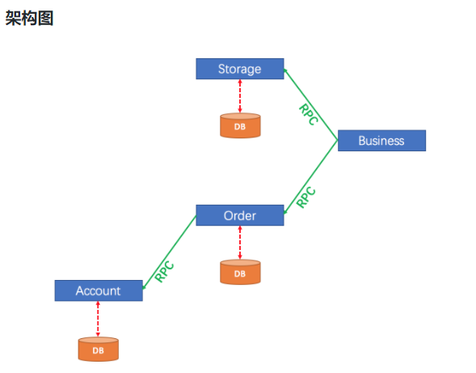

## 创建仓储服务

### 创建

1、新建module：storage-service

此时父工程中出现以下配置：

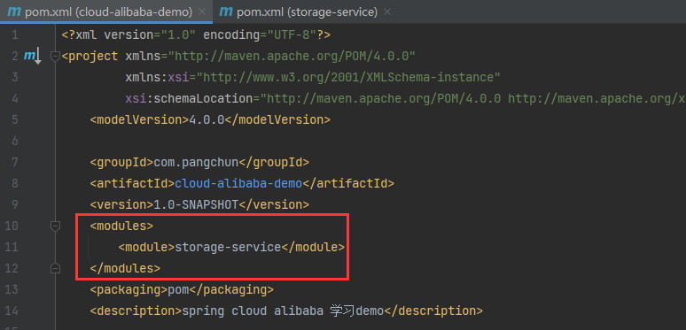

2、添加主启动类：

```java
import org.springframework.boot.SpringApplication;
import org.springframework.boot.autoconfigure.SpringBootApplication;

@SpringBootApplication
public class StorageApplication {

    public static void main(String[] args) {
        SpringApplication.run(StorageApplication.class, args);
    }
}
```

3、添加服务所需依赖：

```xml
<dependencies>
    <!-- spring web -->
    <dependency>
        <groupId>org.springframework.boot</groupId>
        <artifactId>spring-boot-starter-web</artifactId>
    </dependency>

    <!-- nacos config: 配置中心 -->
    <dependency>
        <groupId>com.alibaba.cloud</groupId>
        <artifactId>spring-cloud-starter-alibaba-nacos-config</artifactId>
    </dependency>
</dependencies>
```

4、设置配置文件bootstrap.yml：

关于nacos配置中心的配置，请参考下面的 [整合nacos配置中心](#整合nacos配置中心) 。

```yml
spring:
  application:
    name: storage-service
  cloud:
    nacos:
      config:
        server-addr: 127.0.0.1:8848
        namespace: demo
        group: demo
        file-extension: yaml
        refresh-enabled: true
```

5、整合nacos注册与发现：

请参考下面的 [整合nacos注册与发现](#整合nacos注册与发现)

6、连接数据库并集成mybatis-plus：

第一步：先按照 [整合数据库](#整合数据库)，创建仓储服务相关的数据库和数据表

第二步：导入依赖

```xml
<!--lombok : 没有被父项目管理的版本号暂时不用管，后面会将公共依赖抽取到父项目-->
<dependency>
    <groupId>org.projectlombok</groupId>
    <artifactId>lombok</artifactId>
    <version>1.16.18</version>
</dependency>

<!--jdbc-->
<dependency>
    <groupId>org.springframework.boot</groupId>
    <artifactId>spring-boot-starter-data-jdbc</artifactId>
</dependency>

<!--mysql-->
<dependency>
    <groupId>mysql</groupId>
    <artifactId>mysql-connector-java</artifactId>
</dependency>

<!--mybatis-plus -->
<dependency>
    <groupId>com.baomidou</groupId>
    <artifactId>mybatis-plus-boot-starter</artifactId>
    <version>3.4.0</version>
</dependency>
```

第三步：设置配置文件

```yml
spring:
  datasource:
    url: jdbc:mysql://localhost:3306/storage?userSSL=true&useUnicode=true&characterEncoding=UTF-8&serverTimezone=UTC&allowMultiQueries=true
    username: root
    password: root
    driver-class-name: com.mysql.cj.jdbc.Driver
```

第四步：创建目录准备测试数据库连接

创建以下目录，类不用创建，直接粘贴我的类即可。

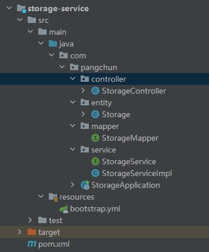

第五步：粘贴以下类

- 实体类

```java
import com.baomidou.mybatisplus.annotation.IdType;
import com.baomidou.mybatisplus.annotation.TableField;
import com.baomidou.mybatisplus.annotation.TableId;
import com.baomidou.mybatisplus.annotation.TableName;
import lombok.Data;

import java.io.Serializable;

@TableName("t_storage")
@Data
public class Storage implements Serializable {

    @TableId(type = IdType.AUTO)
    private Long id;

    @TableField("product_id")
    private Long productId;

    @TableField("total")
    private Double total;

    @TableField("used")
    private Double used;

    @TableField("residue")
    private Double residue;
}
```

- mapper

```java
import com.baomidou.mybatisplus.core.mapper.BaseMapper;
import com.pangchun.entity.Storage;

public interface StorageMapper extends BaseMapper<Storage> {
}
```

- service

```java
import com.baomidou.mybatisplus.extension.service.IService;
import com.pangchun.entity.Storage;

public interface StorageService extends IService<Storage> {
}
```

```java
import com.baomidou.mybatisplus.extension.service.impl.ServiceImpl;
import com.pangchun.entity.Storage;
import com.pangchun.mapper.StorageMapper;
import org.springframework.stereotype.Service;

@Service
public class StorageServiceImpl extends ServiceImpl<StorageMapper, Storage> implements StorageService {
}
```

- controller

```java
import com.pangchun.entity.Storage;
import com.pangchun.service.StorageService;
import org.springframework.web.bind.annotation.GetMapping;
import org.springframework.web.bind.annotation.RequestMapping;
import org.springframework.web.bind.annotation.RestController;

import javax.annotation.Resource;

@RestController
@RequestMapping("/storage")
public class StorageController {

    @Resource
    private StorageService storageService;

    @GetMapping("/get")
    public Storage get() {
        Storage storage = storageService.getById(1);
        System.out.println(storage.toString());
        return storage;
    }
}
```

第六步：设置主启动类

```java
@MapperScan("com.pangchun.mapper")
```

第七步：测试访问

为数据库添加一条记录并测试：

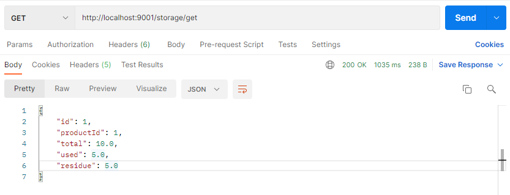

由于我9000端口被占用，所以用的9001端口。

### 小结

小结：至此，仓储服务就创建成功了，至于接口会在三个服务都创建之后再编写。

## 创建订单服务

参照仓储服务创建，下面给出我的代码。

目录结构如下：

两个服务的目录结构都与仓储服务一致。

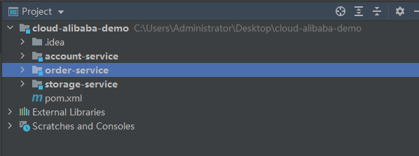

1、pom文件

```xml
<?xml version="1.0" encoding="UTF-8"?>
<project xmlns="http://maven.apache.org/POM/4.0.0"
         xmlns:xsi="http://www.w3.org/2001/XMLSchema-instance"
         xsi:schemaLocation="http://maven.apache.org/POM/4.0.0 http://maven.apache.org/xsd/maven-4.0.0.xsd">
    <parent>
        <artifactId>cloud-alibaba-demo</artifactId>
        <groupId>com.pangchun</groupId>
        <version>1.0-SNAPSHOT</version>
    </parent>
    <modelVersion>4.0.0</modelVersion>

    <artifactId>order-service</artifactId>

    <properties>
        <maven.compiler.source>8</maven.compiler.source>
        <maven.compiler.target>8</maven.compiler.target>
    </properties>

    <dependencies>
        <!-- spring web -->
        <dependency>
            <groupId>org.springframework.boot</groupId>
            <artifactId>spring-boot-starter-web</artifactId>
        </dependency>

        <!-- nacos config: 配置中心 -->
        <dependency>
            <groupId>com.alibaba.cloud</groupId>
            <artifactId>spring-cloud-starter-alibaba-nacos-config</artifactId>
        </dependency>

        <!-- nacos discovery: 服务发现 -->
        <dependency>
            <groupId>com.alibaba.cloud</groupId>
            <artifactId>spring-cloud-starter-alibaba-nacos-discovery</artifactId>
        </dependency>

        <!--lombok : 没有被父项目管理的版本号暂时不用管，后面会将公共依赖抽取到父项目-->
        <dependency>
            <groupId>org.projectlombok</groupId>
            <artifactId>lombok</artifactId>
            <version>1.16.18</version>
        </dependency>

        <!--jdbc-->
        <dependency>
            <groupId>org.springframework.boot</groupId>
            <artifactId>spring-boot-starter-data-jdbc</artifactId>
        </dependency>

        <!--mysql-->
        <dependency>
            <groupId>mysql</groupId>
            <artifactId>mysql-connector-java</artifactId>
        </dependency>

        <!--mybatis-plus -->
        <dependency>
            <groupId>com.baomidou</groupId>
            <artifactId>mybatis-plus-boot-starter</artifactId>
            <version>3.4.0</version>
        </dependency>

    </dependencies>

</project>
```

2、配置文件

```yml
spring:
  application:
    name: order-service
  cloud:
    nacos:
      config:
        server-addr: 127.0.0.1:8848
        namespace: demo
        group: demo
        file-extension: yaml
        refresh-enabled: true
      discovery:
        server-addr: 127.0.0.1:8848
        namespace: demo
        group: demo
  datasource:
    url: jdbc:mysql://localhost:3306/order?userSSL=true&useUnicode=true&characterEncoding=UTF-8&serverTimezone=UTC&allowMultiQueries=true
    username: root
    password: root
    driver-class-name: com.mysql.cj.jdbc.Driver
```

3、启动类

```java
import org.mybatis.spring.annotation.MapperScan;
import org.springframework.boot.SpringApplication;
import org.springframework.boot.autoconfigure.SpringBootApplication;
import org.springframework.cloud.client.discovery.EnableDiscoveryClient;

@SpringBootApplication
@EnableDiscoveryClient
@MapperScan("com.pangchun.mapper")
public class OrderApplication {

    public static void main(String[] args) {
        SpringApplication.run(OrderApplication.class, args);
    }
}
```

4、实体类

```java
import com.baomidou.mybatisplus.annotation.IdType;
import com.baomidou.mybatisplus.annotation.TableField;
import com.baomidou.mybatisplus.annotation.TableId;
import com.baomidou.mybatisplus.annotation.TableName;
import lombok.Data;

import java.io.Serializable;

@TableName("t_order")
@Data
public class Order implements Serializable {

    @TableId(type = IdType.AUTO)
    private Long id;

    @TableField("user_id")
    private Long userId;

    @TableField("product_id")
    private Long productId;

    @TableField("count")
    private Integer count;

    @TableField("money")
    private Double money;

    @TableField("status")
    private Integer status;
}
```

5、service

```java
import com.baomidou.mybatisplus.extension.service.IService;
import com.pangchun.entity.Order;

public interface OrderService extends IService<Order> {
}
```

```java
import com.baomidou.mybatisplus.extension.service.impl.ServiceImpl;
import com.pangchun.entity.Order;
import com.pangchun.mapper.OrderMapper;
import org.springframework.stereotype.Service;

@Service
public class OrderServiceImpl extends ServiceImpl<OrderMapper, Order> implements OrderService {
}
```

6、mapper

```java
import com.baomidou.mybatisplus.core.mapper.BaseMapper;
import com.pangchun.entity.Order;

public interface OrderMapper extends BaseMapper<Order> {
}
```

7、nacos远程配置


8、controller

```java
import com.pangchun.entity.Order;
import com.pangchun.service.OrderService;
import org.springframework.web.bind.annotation.GetMapping;
import org.springframework.web.bind.annotation.RequestMapping;
import org.springframework.web.bind.annotation.RestController;

import javax.annotation.Resource;

@RestController
@RequestMapping("/order")
public class OrderController {

    @Resource
    private OrderService orderService;

    @GetMapping("/get")
    public Order get() {
        Order order = orderService.getById(1);
        System.out.println(order.toString());
        return order;
    }
}
```

## 创建账户服务

参照仓储服务创建，下面给出我的代码。

1、pom文件

```xml
<?xml version="1.0" encoding="UTF-8"?>
<project xmlns="http://maven.apache.org/POM/4.0.0"
         xmlns:xsi="http://www.w3.org/2001/XMLSchema-instance"
         xsi:schemaLocation="http://maven.apache.org/POM/4.0.0 http://maven.apache.org/xsd/maven-4.0.0.xsd">
    <parent>
        <artifactId>cloud-alibaba-demo</artifactId>
        <groupId>com.pangchun</groupId>
        <version>1.0-SNAPSHOT</version>
    </parent>
    <modelVersion>4.0.0</modelVersion>

    <artifactId>account-service</artifactId>

    <properties>
        <maven.compiler.source>8</maven.compiler.source>
        <maven.compiler.target>8</maven.compiler.target>
    </properties>

    <dependencies>
        <!-- spring web -->
        <dependency>
            <groupId>org.springframework.boot</groupId>
            <artifactId>spring-boot-starter-web</artifactId>
        </dependency>

        <!-- nacos config: 配置中心 -->
        <dependency>
            <groupId>com.alibaba.cloud</groupId>
            <artifactId>spring-cloud-starter-alibaba-nacos-config</artifactId>
        </dependency>

        <!-- nacos discovery: 服务发现 -->
        <dependency>
            <groupId>com.alibaba.cloud</groupId>
            <artifactId>spring-cloud-starter-alibaba-nacos-discovery</artifactId>
        </dependency>

        <!--lombok : 没有被父项目管理的版本号暂时不用管，后面会将公共依赖抽取到父项目-->
        <dependency>
            <groupId>org.projectlombok</groupId>
            <artifactId>lombok</artifactId>
            <version>1.16.18</version>
        </dependency>

        <!--jdbc-->
        <dependency>
            <groupId>org.springframework.boot</groupId>
            <artifactId>spring-boot-starter-data-jdbc</artifactId>
        </dependency>

        <!--mysql-->
        <dependency>
            <groupId>mysql</groupId>
            <artifactId>mysql-connector-java</artifactId>
        </dependency>

        <!--mybatis-plus -->
        <dependency>
            <groupId>com.baomidou</groupId>
            <artifactId>mybatis-plus-boot-starter</artifactId>
            <version>3.4.0</version>
        </dependency>

    </dependencies>

</project>
```

2、配置文件

```yml
spring:
  application:
    name: account-service
  cloud:
    nacos:
      config:
        server-addr: 127.0.0.1:8848
        namespace: demo
        group: demo
        file-extension: yaml
        refresh-enabled: true
      discovery:
        server-addr: 127.0.0.1:8848
        namespace: demo
        group: demo
  datasource:
    url: jdbc:mysql://localhost:3306/account?userSSL=true&useUnicode=true&characterEncoding=UTF-8&serverTimezone=UTC&allowMultiQueries=true
    username: root
    password: root
    driver-class-name: com.mysql.cj.jdbc.Driver
```

3、启动类

```java
import org.mybatis.spring.annotation.MapperScan;
import org.springframework.boot.SpringApplication;
import org.springframework.boot.autoconfigure.SpringBootApplication;
import org.springframework.cloud.client.discovery.EnableDiscoveryClient;

@SpringBootApplication
@EnableDiscoveryClient
@MapperScan("com.pangchun.mapper")
public class AccountApplication {

    public static void main(String[] args) {
        SpringApplication.run(AccountApplication.class, args);
    }
}
```

4、实体类

```java
import com.baomidou.mybatisplus.annotation.IdType;
import com.baomidou.mybatisplus.annotation.TableField;
import com.baomidou.mybatisplus.annotation.TableId;
import com.baomidou.mybatisplus.annotation.TableName;
import lombok.Data;

import java.io.Serializable;

@TableName("t_account")
@Data
public class Account implements Serializable {

    @TableId(type = IdType.AUTO)
    private Long id;

    @TableField("user_id")
    private Long userId;

    @TableField("total")
    private Double total;

    @TableField("used")
    private Double used;

    @TableField("residue")
    private Double residue;
}
```

5、service

```java
import com.baomidou.mybatisplus.extension.service.IService;
import com.pangchun.entity.Account;

public interface AccountService extends IService<Account> {
}
```

```java
import com.baomidou.mybatisplus.extension.service.impl.ServiceImpl;
import com.pangchun.entity.Account;
import com.pangchun.mapper.AccountMapper;
import org.springframework.stereotype.Service;

@Service
public class AccountServiceImpl extends ServiceImpl<AccountMapper, Account> implements AccountService {
}
```

6、mapper

```java
import com.baomidou.mybatisplus.core.mapper.BaseMapper;
import com.pangchun.entity.Account;

public interface AccountMapper extends BaseMapper<Account> {
}
```

7、nacos远程配置

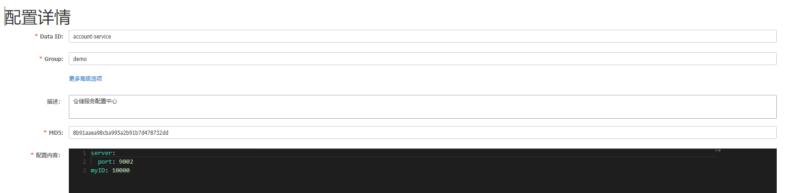

8、controller

```java
import com.pangchun.entity.Account;
import com.pangchun.service.AccountService;
import org.springframework.web.bind.annotation.GetMapping;
import org.springframework.web.bind.annotation.RequestMapping;
import org.springframework.web.bind.annotation.RestController;

import javax.annotation.Resource;

@RestController
@RequestMapping("/account")
public class AccountController {

    @Resource
    private AccountService accountService;

    @GetMapping("/get")
    public Account get() {
        Account account = accountService.getById(1);
        System.out.println(account.toString());
        return account;
    }
}
```

# 整合nacos配置中心

这里我们以仓储服务为例。

## 安装启动nacos

根据官方文档或者我的nacos笔记完成安装与启动即可。

## 集成至项目

1、在nacos控制台添加命名空间：

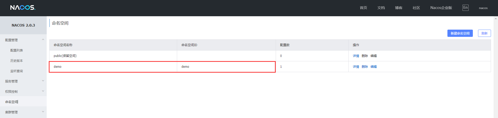

2、在demo命名空间下添加配置：

注意：

- 这里的Data Id要与你的应用名称保持一致；（应用名称配置在bootstrap.xml中）

  ```yml
  spring:
    application:
      name: storage-service
  ```

- nacos的配置文件格式选择yaml；

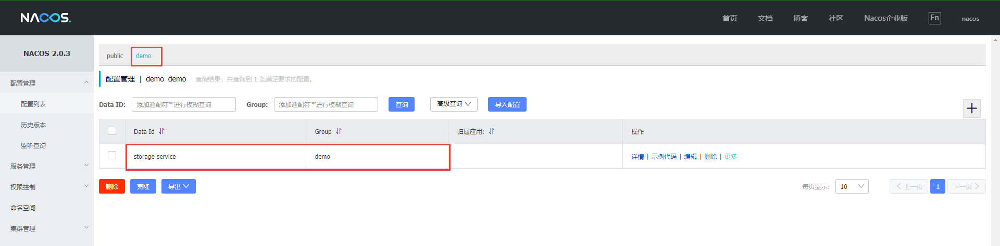

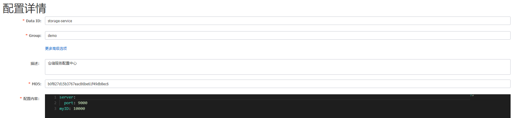

3、配置bootstrap.xml文件：

```yml
spring:
  application:
    name: storage-service
  cloud:
    nacos:
      config:
        server-addr: 127.0.0.1:8848
        namespace: demo
        group: demo
        file-extension: yaml
        refresh-enabled: true
```

4、测试配置中心是否生效：

接口如下：

在nacos中配置的myID以及修改的项目端口9000都应该生效；

```java
@RestController
@RequestMapping("/test")
public class TestController {

    @Value("${myID}")
    private String data;

    @GetMapping("/get")
    public String get() {
        return data;
    }
}
```

访问测试：

可见配置已经生效；

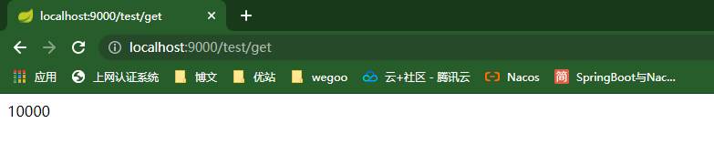

# 整合nacos注册与发现

同样以仓储服务为例。

## 集成至项目

1、添加依赖：

```xml
<!-- nacos discovery: 服务发现 -->
<dependency>
    <groupId>com.alibaba.cloud</groupId>
    <artifactId>spring-cloud-starter-alibaba-nacos-discovery</artifactId>
</dependency>
```

2、启动类添加注解：

```java
@EnableDiscoveryClient
```

3、配置文件设置：

```yml
spring:
  cloud:
    nacos:
      discovery:
        server-addr: 127.0.0.1:8848
        namespace: demo
        group: demo
```

4、启动项目打开nacos控制台服务列表：

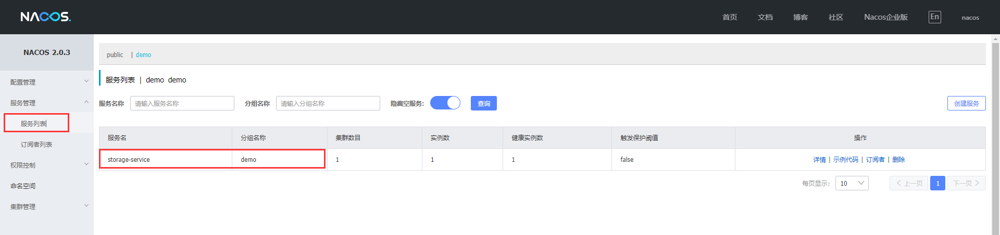

# 整合数据库

## 建表建库

1、仓储数据库：


```mysql
CREATE TABLE `t_storage` (
                         `id` bigint(11) NOT NULL AUTO_INCREMENT,
                         `product_id` bigint(11) DEFAULT NULL COMMENT '产品id',
                         `total` int(11) DEFAULT NULL COMMENT '总库存',
                         `used` int(11) DEFAULT NULL COMMENT '已用库存',
                         `residue` int(11) DEFAULT NULL COMMENT '剩余库存',
                         PRIMARY KEY (`id`)
) ENGINE=InnoDB AUTO_INCREMENT=2 DEFAULT CHARSET=utf8;

INSERT INTO `seat-storage`.`storage` (`id`, `product_id`, `total`, `used`, `residue`) VALUES ('1', '1', '100', '0', '100');
```

2、订单数据库：

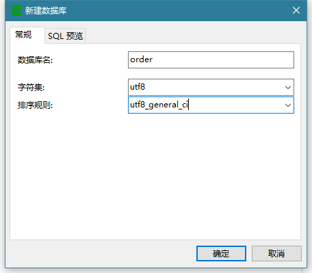

```mysql
CREATE TABLE `t_order` (
  `id` bigint NOT NULL AUTO_INCREMENT,
  `user_id` bigint DEFAULT NULL COMMENT '用户id',
  `product_id` bigint DEFAULT NULL COMMENT '产品id',
  `count` int DEFAULT NULL COMMENT '数量',
  `money` decimal(11,0) DEFAULT NULL COMMENT '金额',
  `status` int DEFAULT NULL COMMENT '订单状态：0：创建中；1：已完结',
  PRIMARY KEY (`id`)
) ENGINE=InnoDB AUTO_INCREMENT=7 DEFAULT CHARSET=utf8;
```

3、账户数据库：


```mysql
CREATE TABLE `t_account` (
  `id` bigint(11) NOT NULL AUTO_INCREMENT COMMENT 'id',
  `user_id` bigint(11) DEFAULT NULL COMMENT '用户id',
  `total` decimal(10,0) DEFAULT NULL COMMENT '总额度',
  `used` decimal(10,0) DEFAULT NULL COMMENT '已用余额',
  `residue` decimal(10,0) DEFAULT '0' COMMENT '剩余可用额度',
  PRIMARY KEY (`id`)
) ENGINE=InnoDB AUTO_INCREMENT=2 DEFAULT CHARSET=utf8;

INSERT INTO `seat-account`.`account` (`id`, `user_id`, `total`, `used`, `residue`) VALUES ('1', '1', '1000', '0', '1000');
```

# 整合服务之间的依赖

## 背景

由3个服务之间可能会相互使用彼此的实体类，因此我们将三个服务互相依赖。在实际项目中一般不会这样设置，因为耦合性太强。

真实项目中，应该是将每个服务的实体和service抽取为单独的api模块（module），剩下的controller、mapper、serviceImpl作为单独的service模块（module），在设置依赖时只需要在其它服务中引入api模块的依赖即可。

## 设置

1、先从账户服务找到这三个标签：

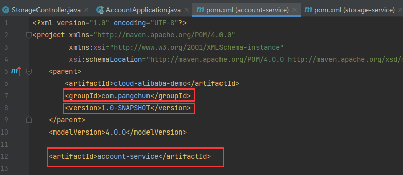

2、然后在仓储服务中添加账户服务的依赖：

下面的${project.version}不用单独设置，这表示使用父项目的版本号，不难发现，这三个标签对应的正是账户服务的groupId、artifactId、version；

```xml
<!-- 账户服务 -->
<dependency>
    <groupId>com.pangchun</groupId>
    <artifactId>account-service</artifactId>
    <version>${project.version}</version>
</dependency>
```

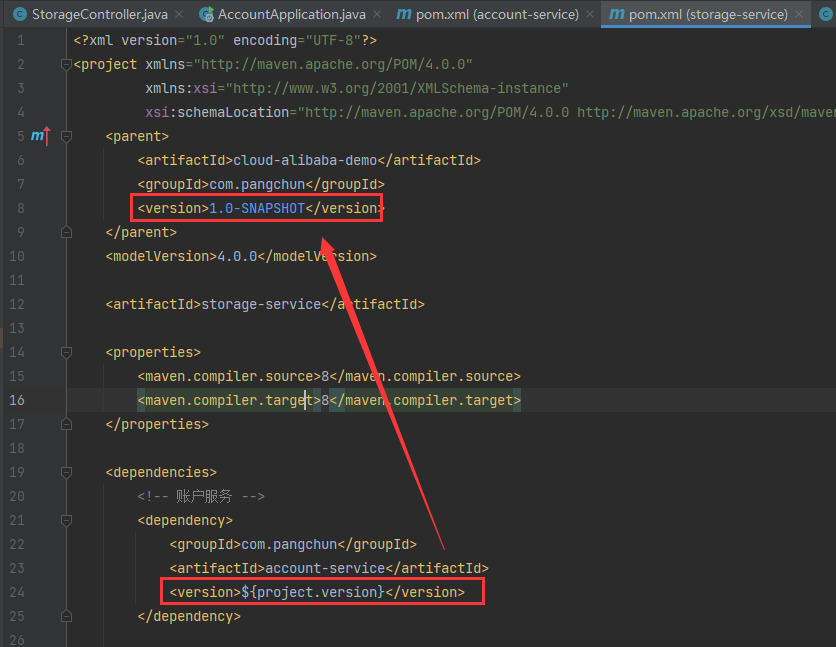

3、按照以上步骤，将每个服务的依赖互相引入：

在某个服务粘贴另外两个服务的依赖即可；

```xml
<!-- 账户服务 -->
<dependency>
    <groupId>com.pangchun</groupId>
    <artifactId>account-service</artifactId>
    <version>${project.version}</version>
</dependency>

<!-- 仓储服务 -->
<dependency>
    <groupId>com.pangchun</groupId>
    <artifactId>storage-service</artifactId>
    <version>${project.version}</version>
</dependency>

<!-- 订单服务 -->
<dependency>
    <groupId>com.pangchun</groupId>
    <artifactId>order-service</artifactId>
    <version>${project.version}</version>
</dependency>
```

4、查看maven如下：

每个服务都引入了另外两个服务的依赖；

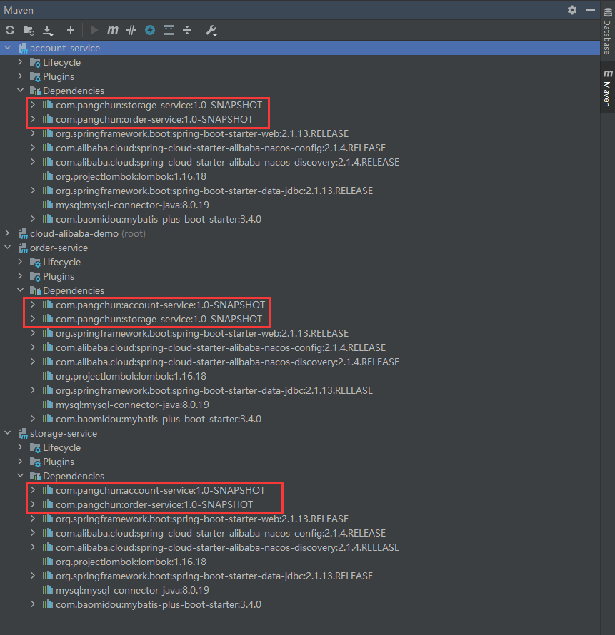

5、补充修改：

上述步骤引入依赖后启动项目报错，原因是造成了module之间的循环依赖：

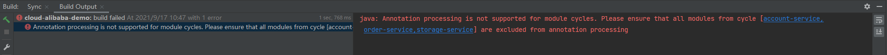

查看循环依赖的方法：

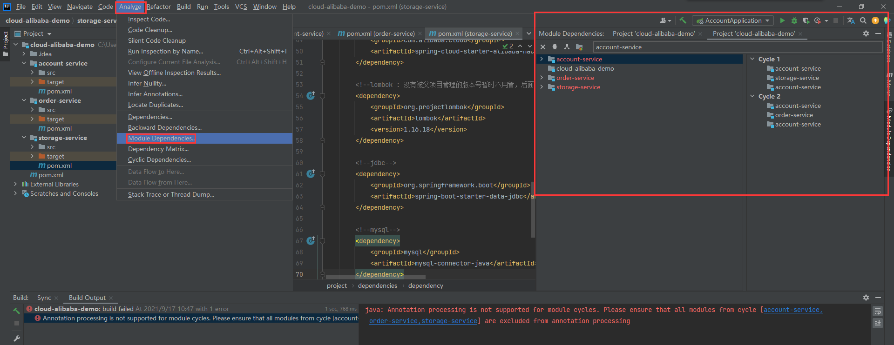

解决：

因为我们是每个module相互引入，我们直接将另外两个module的依赖引入到仓储服务，账户和订单服务中引入的依赖删掉，我们只用仓储服务来测试即可；

此时再编译项目就不会报错了。

# 设置nacos服务之间可远程调用

## 背景

我们本地有3个服务，比如我们的仓储服务如果要调用账户服务的接口，目前是无法调用的，即使我们在仓储服务中引入账户服务的jar包依赖，也会失败，因为目前为止我们并没有整合数据源切换，因此仓储服务的service调用账户服务的service时，只要设计数据库操作就会失败，因为我们的三个服务之间是不同的数据库。

所以，在未整合数据源切换功能的情况下，我们直接通过nacos提供的服务注册发现功能，用RestTemplate来远程调用nacos上注册的服务。

## 设置

接下来我们以账户服务作为服务提供者，仓储服务作为服务消费者为例子，设置仓储服务的远程调用。

1、账户服务不需要修改：

2、修改仓储服务启动类：

给 RestTemplate 实例添加 @LoadBalanced 注解，开启 @LoadBalanced 与 Ribbon 的集成：

```java
import org.mybatis.spring.annotation.MapperScan;
import org.springframework.boot.SpringApplication;
import org.springframework.boot.autoconfigure.SpringBootApplication;
import org.springframework.cloud.client.discovery.EnableDiscoveryClient;
import org.springframework.cloud.client.loadbalancer.LoadBalanced;
import org.springframework.context.annotation.Bean;
import org.springframework.web.client.RestTemplate;

@SpringBootApplication
@EnableDiscoveryClient
@MapperScan("com.pangchun.mapper")
public class StorageApplication {

    public static void main(String[] args) {
        SpringApplication.run(StorageApplication.class, args);
    }

    @LoadBalanced
    @Bean
    public RestTemplate restTemplate() {
        return new RestTemplate();
    }
}
```

3、修改仓储服务接口：

```java
import com.pangchun.entity.Account;
import com.pangchun.entity.Storage;
import com.pangchun.service.StorageService;
import org.springframework.beans.factory.annotation.Autowired;
import org.springframework.web.bind.annotation.GetMapping;
import org.springframework.web.bind.annotation.RequestMapping;
import org.springframework.web.bind.annotation.RestController;
import org.springframework.web.client.RestTemplate;

import javax.annotation.Resource;

@RestController
@RequestMapping("/storage")
public class StorageController {

    private final RestTemplate restTemplate;

    @Resource
    private StorageService storageService;

    @Autowired
    public StorageController(RestTemplate restTemplate) {
        this.restTemplate = restTemplate;
    }

    @GetMapping("/get")
    public Storage get() {
        Storage storage = storageService.getById(1);
        Account account = restTemplate.getForObject("http://account-service/account/get/", Account.class);
        System.out.println(storage.toString());
        System.out.println(account);
        return storage;
    }
}
```

这里的 account-service 对应我们要调用的服务名称，也是在nacos服务列表中显示的名称，/account/get/ 对应的是我们要调用的账户服务的接口地址。

4、测试：

先启动nacos，启动成功后，启动账户服务和仓储服务，打开nacos控制台的服务列表如下：

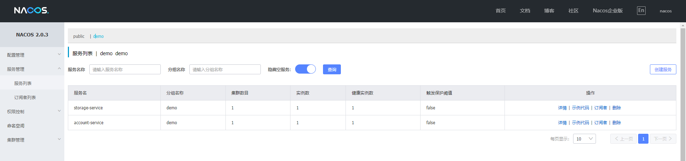

此时两个服务都已经注册到nacos中，打开postman，调用仓储服务接口：

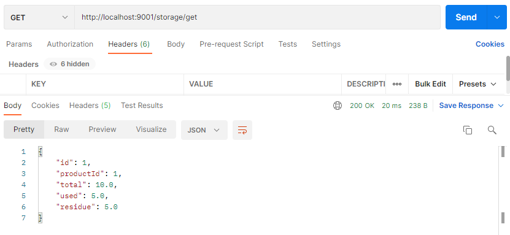

```java
// 仓储服务控制台：
Storage(id=1, productId=1, total=10.0, used=5.0, residue=5.0)
Account(id=1, userId=1, total=1.0, used=1.0, residue=1.0)
    
// 账户服务控制台：
Account(id=1, userId=1, total=1.0, used=1.0, residue=1.0)
```

# 编写接口实现完整的购买流程

1、先将数据库的所有记录清除，然后添加以下几条记录：

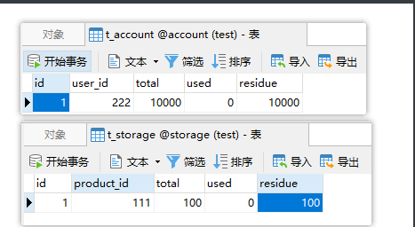

订单表不需要添加记录。

2、编写账户接口：扣除账户金额

```java
@PutMapping("/subtract/{userId}/{money}")
public void subtract(@PathVariable("userId") Long userId, @PathVariable("money") Double money) {
    Account account = accountService.lambdaQuery().eq(Account::getUserId, userId).one();
    boolean flag = accountService.lambdaUpdate()
            .eq(Account::getUserId, userId)
            .set(Account::getUsed, account.getUsed() + money)
            .set(Account::getResidue, account.getResidue() - money)
            .update();
    System.out.println(accountService.getById(account.getId()));
}
```

3、编写订单接口：创建订单

```java
@PostMapping("/create")
public Order create(@RequestBody Order order) {
    // save()方法会自动回填主键id
    boolean flag = orderService.save(order);
    System.out.println(order);
    return order;
}
```

4、编写仓储接口：调用账户与订单的接口，并减少库存

```java
@PostMapping("/buy")
public void buy(Long productId, Long userId) {
    storageService.buy(productId, userId, restTemplate);
}
```

```java
import com.baomidou.mybatisplus.extension.service.IService;
import com.pangchun.entity.Storage;
import org.springframework.web.client.RestTemplate;

public interface StorageService extends IService<Storage> {

    /**
     * 购买一件商品
     *
     * @param productId    商品id
     * @param userId       用户id
     * @param restTemplate {@link RestTemplate}
     */
    void buy(Long productId, Long userId, RestTemplate restTemplate);
}
```

```java
import com.baomidou.mybatisplus.extension.service.impl.ServiceImpl;
import com.pangchun.entity.Order;
import com.pangchun.entity.Storage;
import com.pangchun.mapper.StorageMapper;
import org.springframework.stereotype.Service;
import org.springframework.web.client.RestTemplate;

@Service
public class StorageServiceImpl extends ServiceImpl<StorageMapper, Storage> implements StorageService {

    @Override
    public void buy(Long productId, Long userId, RestTemplate restTemplate) {

        // 1.创建订单
        Order order = new Order();
        order.setProductId(productId);
        order.setUserId(userId);
        order.setCount(1);
        order.setMoney(100.0);
        order.setStatus(0);
        order = restTemplate.postForObject("http://order-service/order/create/", order, Order.class);
        assert order != null;

        // 2.从账户扣除费用
        restTemplate.put("http://account-service/account/subtract/" + userId + "/" + order.getMoney(), null);

        // 3.从仓储扣除库存
        Storage storage = this.lambdaQuery().eq(Storage::getProductId, productId).one();
        boolean flag = this.lambdaUpdate()
                .eq(Storage::getProductId, productId)
                .set(Storage::getUsed, storage.getUsed() + 1)
                .set(Storage::getResidue, storage.getResidue() - 1)
                .update();
        System.out.println(this.getById(storage.getId()));
    }
}
```

5、启动所有服务，测试仓储接口：

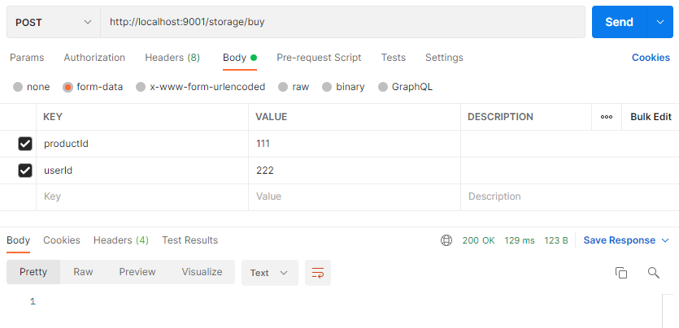

控制台输出如下：

```java
// 仓储服务控制台：
Storage(id=1, productId=111, total=100.0, used=1.0, residue=99.0)

// 账户服务控制台：
Account(id=1, userId=222, total=10000.0, used=100.0, residue=9900.0)

// 订单服务控制台：
Order(id=131, userId=222, productId=111, count=1, money=100.0, status=0)
```

数据库变化如下：

订单表的主键id是自动生成的，不同也没关系；

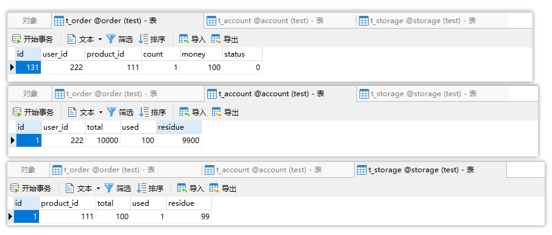

由此可见，整个购买流程是通顺的，那么接下来，我们就集成seata测试分布式事务。在这里我们也可以尝试在创建订单后手动抛出异常停止程序，并查看订单表是否回滚！当然，答案是不会回滚，因为这是分布式系统，这几个数据库的操作并不在同一个事务中，抛出异常是无法回滚所有数据库的操作的。

那么要做到在程序中任何一个地方抛出异常时，都回滚所有数据库的操作，就是我们接下来要解决的问题！

# 整合seata

## 安装与配置

安装与配置请参考我的另一篇笔记--seata笔记！

## 整合到此项目

1、为每个业务数据库添加undo_log表：

建表语句从 https://seata.io/zh-cn/docs/user/quickstart.html 获取：

```mysql
CREATE TABLE `undo_log` (
  `id` bigint(20) NOT NULL AUTO_INCREMENT,
  `branch_id` bigint(20) NOT NULL,
  `xid` varchar(100) NOT NULL,
  `context` varchar(128) NOT NULL,
  `rollback_info` longblob NOT NULL,
  `log_status` int(11) NOT NULL,
  `log_created` datetime NOT NULL,
  `log_modified` datetime NOT NULL,
  `ext` varchar(100) DEFAULT NULL,
  PRIMARY KEY (`id`),
  UNIQUE KEY `ux_undo_log` (`xid`,`branch_id`)
) ENGINE=InnoDB AUTO_INCREMENT=1 DEFAULT CHARSET=utf8;
```

2、为每个服务导入seata依赖：

```xml
<!-- alibaba-seata -->
<dependency>
    <groupId>com.alibaba.cloud</groupId>
    <artifactId>spring-cloud-starter-alibaba-seata</artifactId>
    <exclusions>
        <!-- 排除alibaba中集成的seata，然后导入与我们seata服务器相同版本的seata启动器 -->
        <exclusion>
            <groupId>io.seata</groupId>
            <artifactId>seata-spring-boot-starter</artifactId>
        </exclusion>
    </exclusions>
</dependency>
<!-- 导入与我们seata服务器相同版本的seata启动器，而不是seata的单独依赖，因为yml中的seata配置是由starter提供的 -->
<dependency> 
    <groupId>io.seata</groupId>
    <artifactId>seata-spring-boot-starter</artifactId>
    <version>1.4.2</version>
</dependency>
```

3、为每个服务添加yml配置：

```yml
seata:
  config:
    type: nacos
    nacos:
      server-addr: 127.0.0.1:8848
      namespace: seata
      group: SEATA_GROUP
      username: nacos
      password: nacos
  registry:
    type: nacos
    nacos:
      namespace: demo
      server-addr: 127.0.0.1:8848
      group: SEATA_GROUP
      username: nacos
      password: nacos
  enable-auto-data-source-proxy: true
  tx-service-group: seata-storage-service # 事务分组，需要在nacos中增加一个dataId为service.vgroupMapping.seata-storage-service，内容为default的配置
```

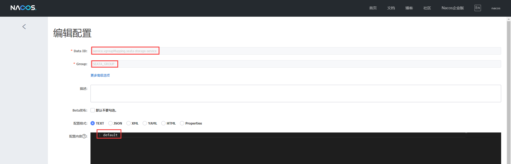

整合完成。

# 测试分布式事务

## 设置分布式事务注解

设置@GlobalTransactional(rollbackFor = Exception.class)：

```java
@Service
public class StorageServiceImpl extends ServiceImpl<StorageMapper, Storage> implements StorageService {

    @Override
    @GlobalTransactional(rollbackFor = Exception.class)
    public void buy(Long productId, Long userId, RestTemplate restTemplate) {
```

在此方法中任意位置手动抛出异常（int a = 1/0;），测试分布式事务。

## 测试

启动nacos，再启动seata服务器，最后启动三个服务，访问buy接口。

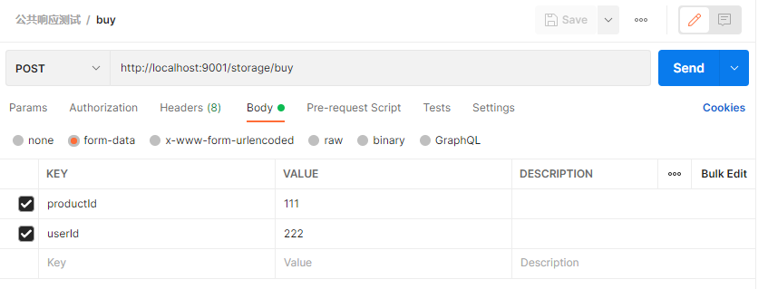

抛出异常，程序结束后查看数据库变化，查看是否所有数据库都已经回滚，验证分布式事务是否生效。

# 小结

到此，关于spring-cloud-alibaba集成nacos作为注册配置中心，整合seata作为分布式事务解决方案的验证就到此结束了。

需要demo源代码的同学请访问我的gitee仓库获取，文档放在项目文件夹中的readme里，克隆项目即可获取。

最后记得给我点个star支持一下。


